# LAMP EN DOS NIVELES
### Primero creamos los script de aprovisionamiento de ambas maquinas
### Scrip de aprovisionamiento para Apache2
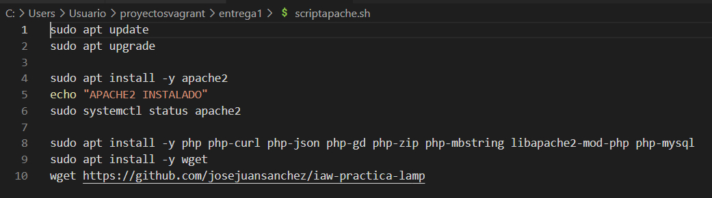
### Script de aprovisionamiento para Mysql
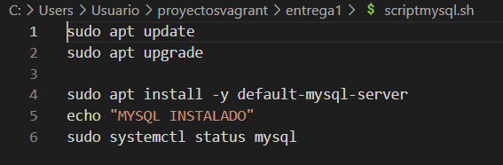
### Modificamos el Vagrantfile, donde creamos las dos maquinas que vamos a usar, asignando sistema operativo, direccionamiento, etc...
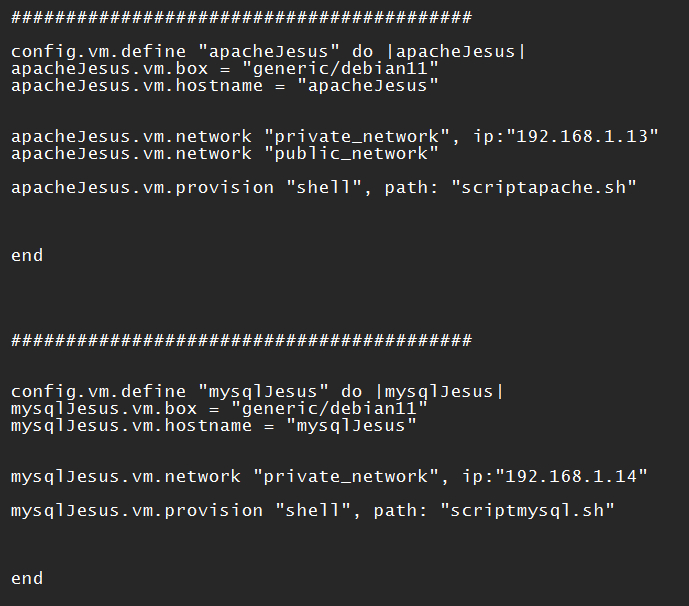
### Tras esto, hacemos **vagrant up** para levantar el entorno. Podemos comprobar que ambas maquinas estan corriendo y que no ha habido ningun error con el comando **vagrant status**
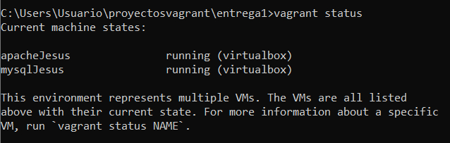
## Configuracion Mysql
### Nos conectamos por ssh a la maquina de Mysql. Una vez conectados ejecutamos **mysql -u root** seguido de un **alter user** donde le asignamos una contraseña al root
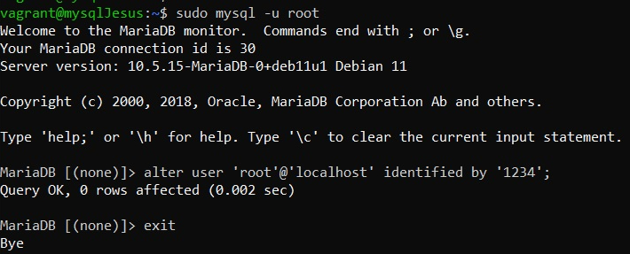
### Lo siguiente es acceder al directorio */etc/mysql/mariadb.conf.d/* donde ejecutaremos un **sudo nano 50-server.conf** para modificar el archivo y añadir la ip de la maquina de Mysql
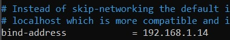
### Nos desplazamos al directorio home y con el comando **sudo git clone** clonamos el repositorio donde se encuentra la aplicacion
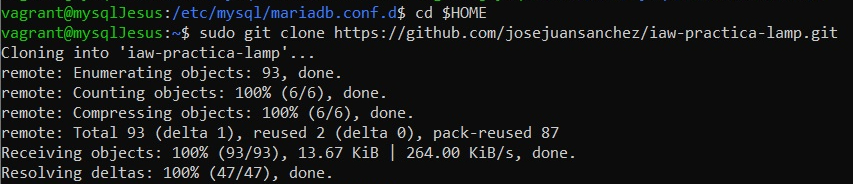
### Entramos dentro del repositorio clonado y dentro de la carpeta *db* ejecutamos el comando **sudo mysql -u root -p < database.sql** para cargar la base de datos
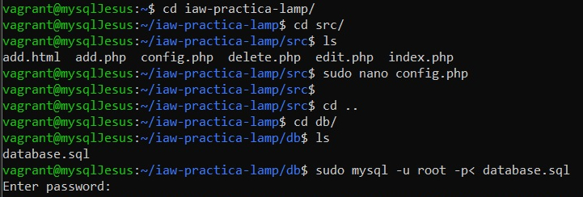
### A continuacion creamos el usuario *lamp_user* y le asignamos la contraseña *lamp_password* y le damos permisos para la base de datos que acabamos de cargar
#### Nota: el usario sera creado sustituyendo *localhost* por un *%* para que pueda iniciar sesion desde otras maquinas 
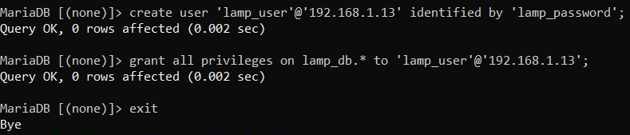
## Configuracion Apache
### Nos conectamos por ssh a la maquina Apache. Una vez conectados nos vamos al directorio */var/www/* y creamos una carpeta donde mas tarde moveremos varios archivos
#### Nota: con el comando **sudo chown -R** cambiamos el propietario a www-data.www-data
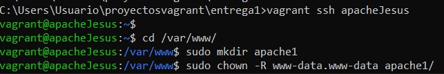
### Dentro de la carpeta que acabamos de crear ejecutamos el comando **sudo git clone** para clonar el repositorio donde se encuentra la aplicacion.
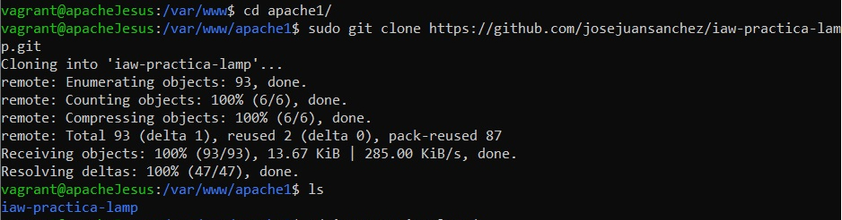
### Dentro del repositorio clonado en la carpeta *src* copiamos todo el contenido a la carpeta creada anteriormente
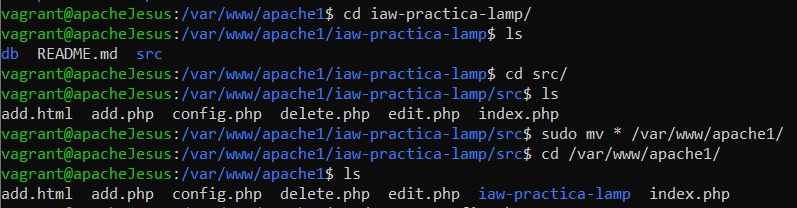
### Volvemos a dicha carpeta y editamos el archivo config.php para añadir la ip de la maquina Mysql
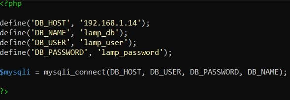
### Nos movemos a la ruta */etc/apache2/sites-available/* y hacemos una copia del archivo 000-default.conf con otro nombre
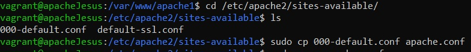
### Editamos la copia y en *DocumentRoot* cambiamos la ruta por la de la carpeta que creamos con anterioridad
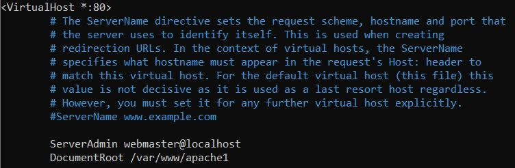
### Ejecutamos el comando **sudo a2ensite apache.conf**  y nos movemos a la ruta */etc/apache2/sites-enabled/* donde ejecutamos **sudo a2dissite 000-default.conf**
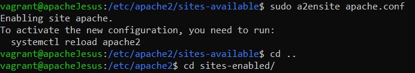
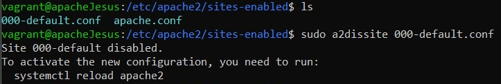
### Por ultimo solo queda instalar mysql-client
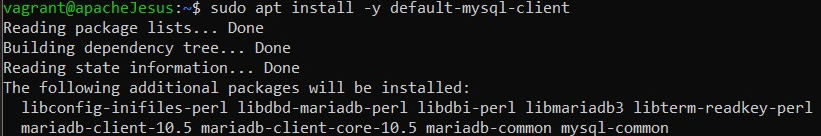